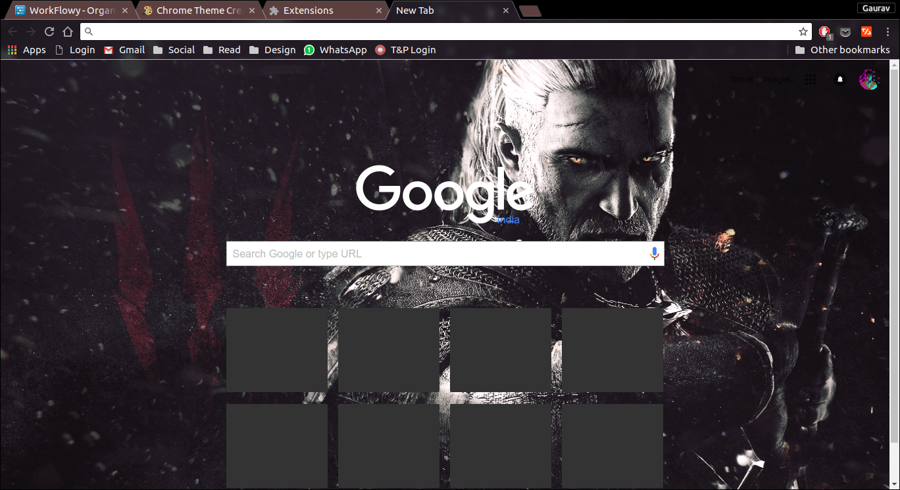

# Witcher 3 The Wild Hunt Chrome Theme
This theme was born out of boredom and an awesome wallpaper found on deviantart.com. Here's the [link](http://fav.me/d7wgxb8) for the wallpaper.

## Steps for installing this theme 
Go to this [link](https://www.themebeta.com/chrome/theme/837293) and hit apply. 

If that doesn't work for you, follow these steps:

1. Clone this repo on your computer.
2. Go to Chrome and type "chrome://extensions/" in your address bar.
3. Press "Load unpacked extension" button and select the repo on your local machine
4. Enjoy - The theme is now installed.
5. If you wish to remove the Google search bar and the most visited sites in the new tab, I'll recommend installing this theme alongside [Popsicle](https://chrome.google.com/webstore/detail/popsicle/loigpbgkmjjhjodnhlpmbjmojchpdjih) 
, a new tab extension which you can customize to hide useless stuff.

I'm also providing the crx file in case somebody needs it.

## Screenshots
**Theme with Popsicle.**

**Theme with no Popsicle showing google search bar and most visited sites in new tab.**

