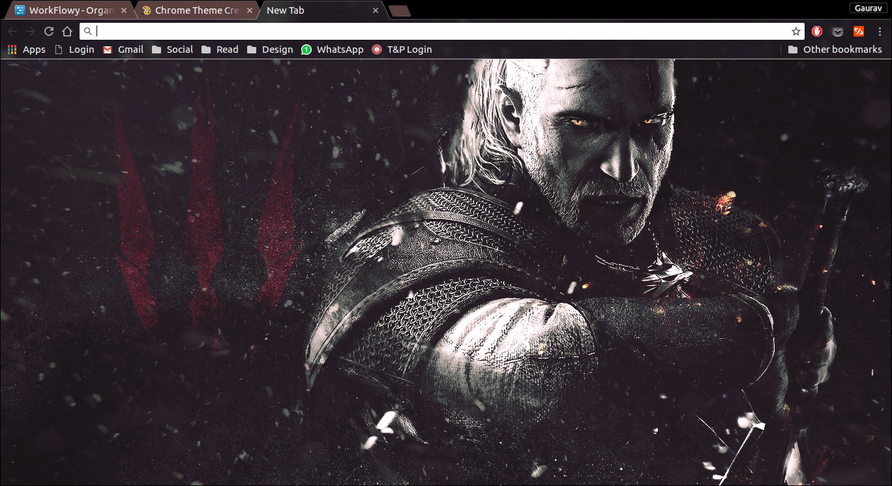

# Witcher 3 The Wild Hunt Chrome Theme
This theme was born out of boredom and an awesome wallpaper found on deviantart.com. Here's the [link](http://fav.me/d7wgxb8) for the wallpaper.

I'll recommend installing this theme alongside [Popsicle](https://chrome.google.com/webstore/detail/popsicle/loigpbgkmjjhjodnhlpmbjmojchpdjih) 
, a new tab extension which you can customize to hide useless stuff.

## Steps for installing this theme 
1. Clone this repo on your computer.
2. Go to Chrome and type "chrome://extensions/" in your address bar.
3. Press "Load unpacked extension" button and select the repo on your local machine
4. Enjoy - The theme is now installed.

I'm also providing the crx file in case somebody needs it.

## Screenshots

